# eCommerce 

Este proyecto fue creado usando la tecnología de desarrollo web M.E.R.N.

## Componentes de M.E.R.N: 

- **M (MongoDB)**: una base de datos NoSQL que se utiliza para almacenar datos. 
- **E (Express.js)**: un framework de Node.js que se utiliza para crear aplicaciones web. 
- **R (React.js)**: una biblioteca de JavaScript que se utiliza para crear interfaces de usuario. 
- **N (Node.js)**: un entorno de ejecución de JavaScript que se utiliza para crear aplicaciones web.

**Nota:** se utilizó una base de datos relacional **PostgreSQL** para la creación de los usuarios y su respectiva
autenticación dentro del sistema utilizando **JWT** y un mecanismo de encriptado usando la biblioteca **bcrypt**.

## Indicaciones y requisitos para clonar el proyecto

1. **REQUISITOS:** Para poder utilizar este proyecto es necesario tener instalado en tu máquina local los siguientes programas: 

    - **Node.js**
    - **MongoDB**
    - **PostgreSQL**

**PASO 1: Clonar repositorio** Crear una carpeta en la ruta que desees, abrir esta carpeta en *Visual Studio Code* o tu editor de preferencia. Ejecutar el siguiente comando desde la CONSOLA <code>git init</code> una vez inicializado el repositorio ingresa este otro comando <code>git clone <ruta_de_este_repositorio></code> este proyecto cuenta con dos carpetas una para el *frontend* y otra para el *backend*. 

**PASO 2: Instalar las dependencias** En la CONSOLA del editor utilizar el comando <code>cd frontend</code> para ingresar a la carpeta *frontend*, luego ingresa el comando <code>npm install</code> este comando permitirá instalar las dependencias del archivo *package.json* tailwind, react, react-dom-route, axios...

Este mismo paso se realizará para el backend verificando que la ruta actual sea la carpeta de *backend* se ejecuta el comando <code>npm install</code> para instalar las dependencias *nodemon*, *cors*, *mongoose*, *jsonwebtoken*...

**PASO 3: Iniciar la conexión con las bases de datos** Abrir la terminal de Windows y escribir cmd, una vez dentro escribir el comando <code>mongod</code> para habilitar la conexión con la base de datos MongoDB.

De igual forma verificar la existencia de la conexión con PostgreSQL,

- debes crear la base de datos <code>CREATE DATABASE mi_base_de_datos_usuarios></code> en Postgres ya que a diferencia de Mongo éste no crea automáticamente la base de datos.
    
- Crear la tabla <code>"usuarios"</code> con la siguiente query:

        - CREATE TABLE usuarios (
            id SERIAL PRIMARY KEY, 
            nombre VARCHAR(255) NOT NULL, 
            correo VARCHAR(255) NOT NULL, 
            password VARCHAR(50) NOT NULL, 
            direccion VARCHAR(255) NOT NULL, 
            telefono VARCHAR(50) NOT NULL, 
            rol VARCHAR(50) DEFAULT 'cliente');

**PASO 4: Levantar el servidor** Se debe iniciar el servidor tanto en el *backend* como en el *frontend* desde la CONSOLA con los comandos que se muestran a continuación.

    - Para el backend se ejecuta el comando: 
        npx nodemon servidor.js
    
    - Para el frontend se ejecuta el comando:
        npm start 

**NOTA:** Este proyecto cuenta con una colección de productos de prueba en la raíz del proyecto llamado **eCommerce.productos.json** el cual contienen los datos para su visualización en el eCommerce:

*¿Cómo utilizarlo?* 

Desde **MongoDB Compass** se puede importar este archivo **JSON** dentro de la colección de productos y así poder visualizar la lista de Productos en el *frontend*

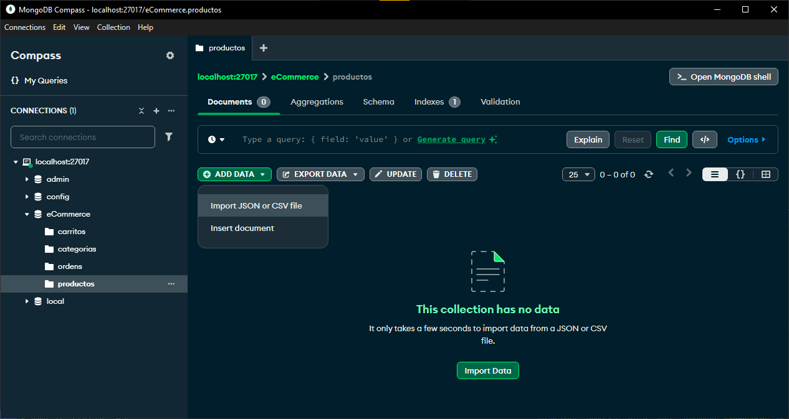

## Pruebas de la API

Para las pruebas de las diferentes *rutas* y *controladores* se utilizó **Postman** a continuación se detalla el proceso de cada uno de los modelos y su CRUD (Create, Read, Update, Delete):

**Creación de un producto:** 

<video controls src="./multimedia/crearProducto.mp4" title="Crear Producto"></video>

**Actualización de un producto:**

<video controls src="./multimedia/actualizarProducto.mp4" title="Actualizar Producto"></video>

**Eliminación de un producto:**

<video controls src="./multimedia/eliminarProducto.mp4" title="Eliminar Producto"></video>

### Creación de un nuevo usuario y autenticación

        - POST http://localhost:5000/api/usuarios/registro

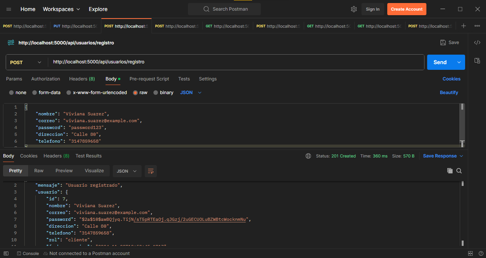

El siguiente paso es iniciar sesión y realizar la autenticación para ello se debe copiar el token entregado en la respuesta del JSON del **POSTMAN** y en la parte de **Autorization** en esa misma ventana seleccionar el tipo *Bearer Token* y pegar el token: 

    POST http://localhost:5000/api/usuarios/iniciarsesion

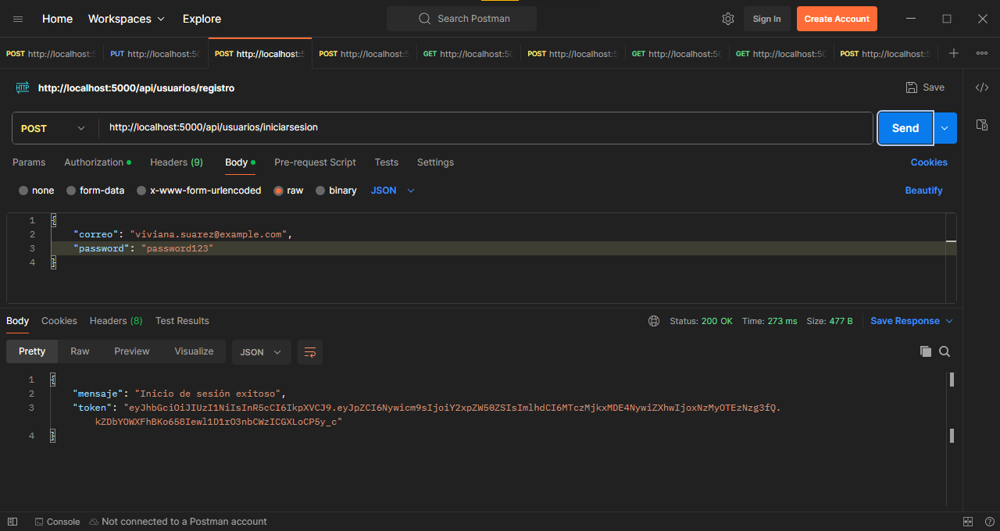

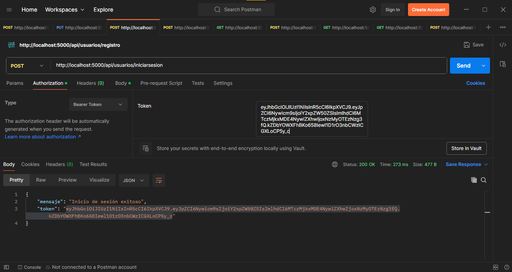

### Creación de una nueva categoría

    POST http://localhost:5000/api/categorias/

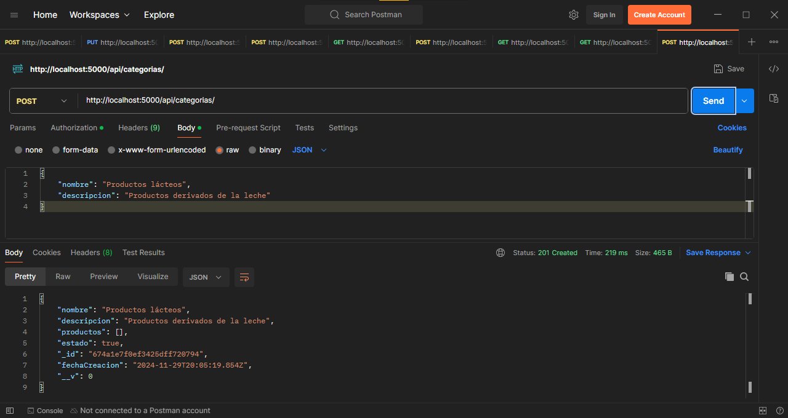

*Actualizar una categoria*:

    PUT http://localhost:5000/api/categorias/:id

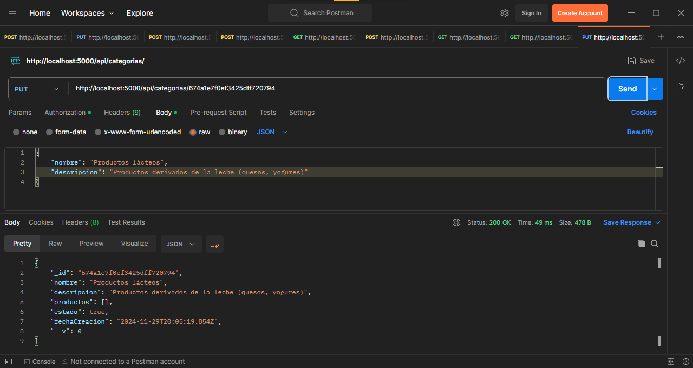

*Eliminar una categoría*:

    DELETE http://localhost:5000/api/categorias/:id

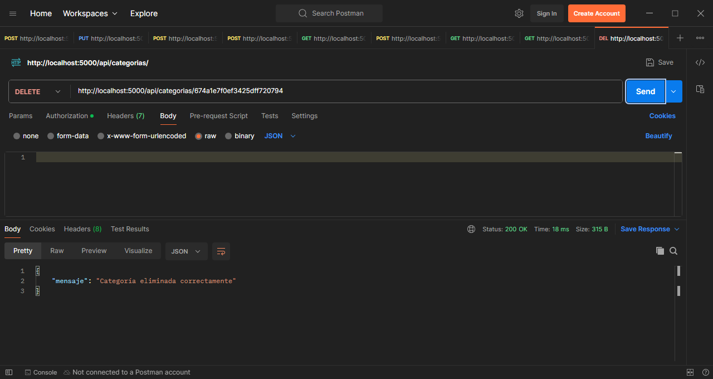

### Creación de un carrito para un usuario

    POST http://localhost:5000/api/carrito/crear

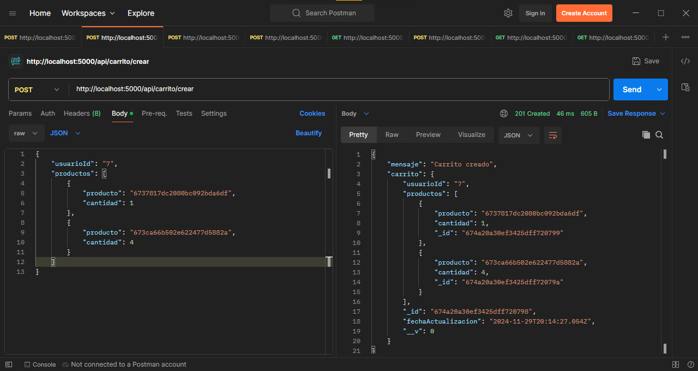

*Obtener el carrito*:

    GET http://localhost:5000/api/carrito/:usuarioId

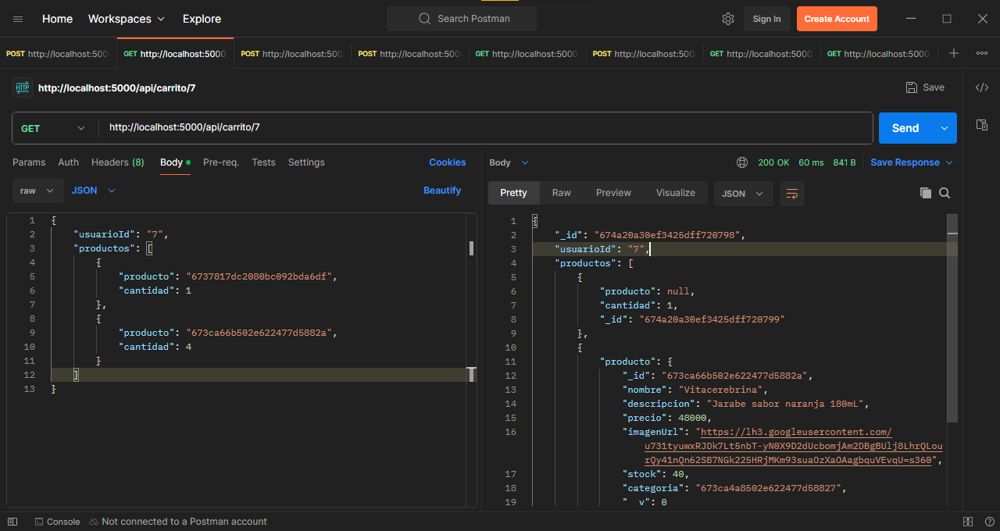

*Actualizar carrito*:

    PUT http://localhost:5000/api/carrito/:usuarioId

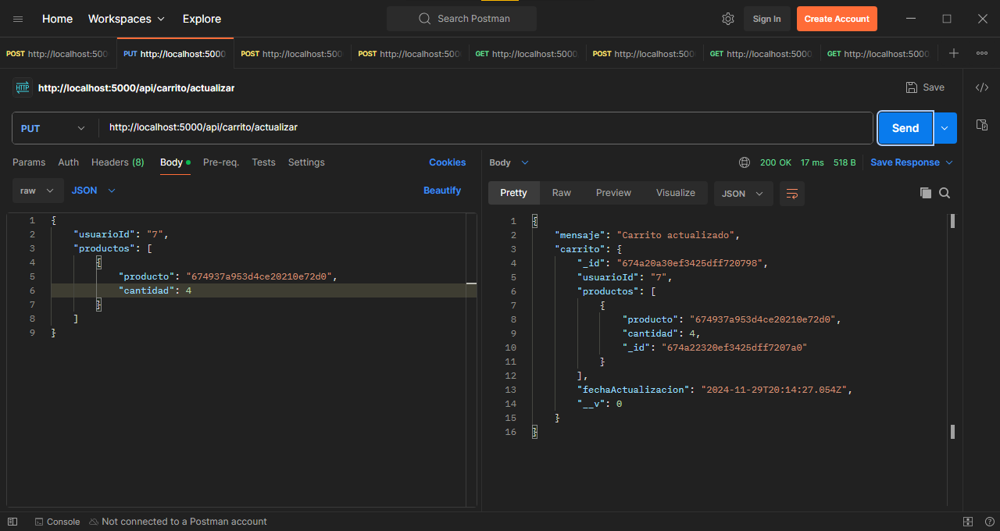

*Eliminar carrito*:

    DELETE http://localhost:5000/api/carrito/vaciar/:usuarioId

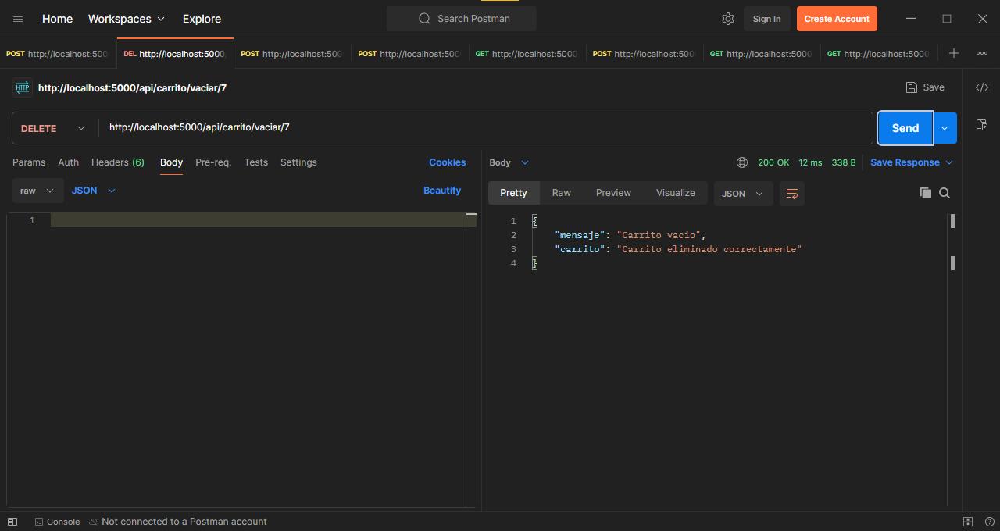

### Creación de una nueva orden

    POST http://localhost:5000/api/ordenes/:usuarioId/crear

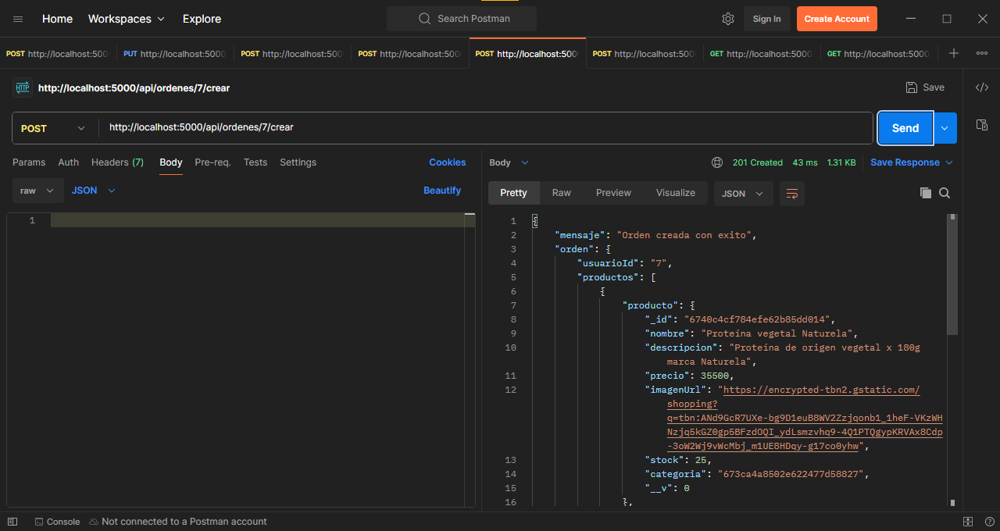

*Obtener orden de un usuario*:

    GET http://localhost:5000/api/ordenes/:usuarioId/orden/:ordenId

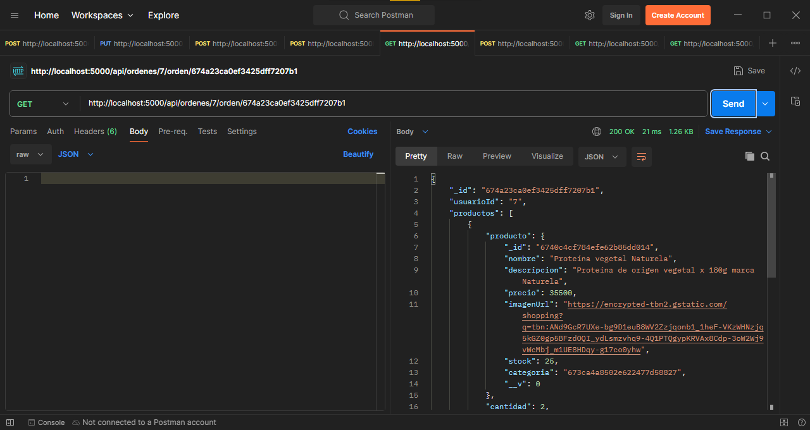

## Visualización del frontend

*Pantalla principal:* 

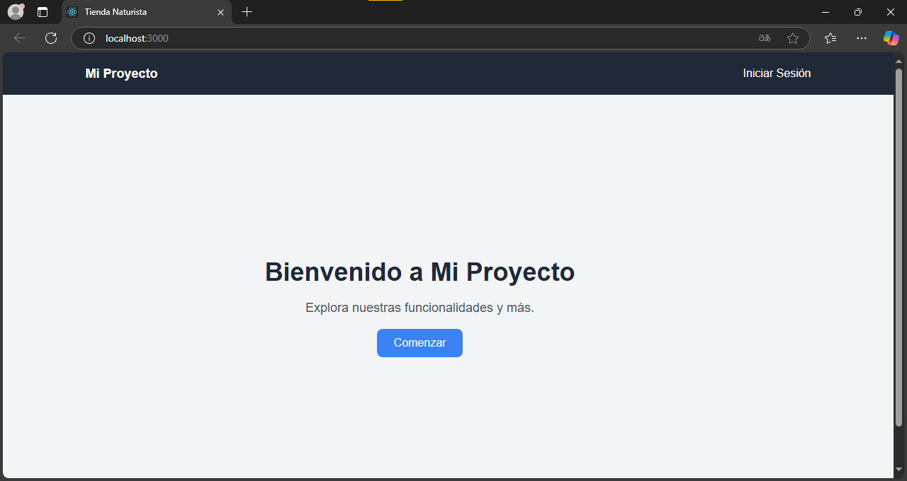

*Iniciar sesión:* 

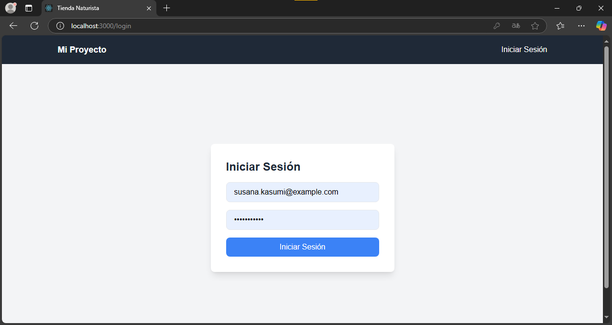

*prueba de la aplicación React*

<video controls src="./multimedia/pruebaReact.mp4" title="Prueba de React App"></video>

